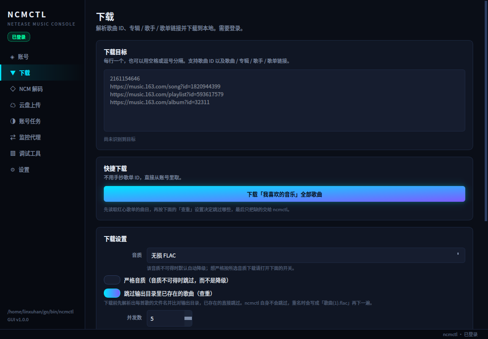

# ncmctl GUI

给 [`ncmctl`](https://github.com/chaunsin/netease-cloud-music) 套的 PyQt6 图形界面，支持 **Windows / Linux / macOS**。

`ncmctl` 本身功能很全，但纯命令行用起来门槛不低：参数散落在各个子命令里，输出目录要手敲，
二维码登录得盯着终端。这个程序把这些都收敛成侧边栏导航 + 表单 + 实时终端输出，
重点解决**输出文件夹的可视化选择**和**长任务 / 扫码登录的可视化反馈**。



## 功能覆盖

ncmctl 的全部子命令都在界面里有对应入口：

| 页面 | 对应命令 | 说明 |
| --- | --- | --- |
| 账号 | `login qrcode` / `phone` / `cookie` / `cookiecloud`、`logout` | 四种登录方式；扫码登录会在界面里显示二维码 |
| 下载 | `download` | 歌曲 ID、专辑 / 歌手 / 歌单链接；选音质、并发数、输出目录；**内置查重**，可一键搬空「我喜欢的音乐」 |
| NCM 解码 | `ncm` | 把 `.ncm` 还原成 `.mp3` / `.flac`，纯本地操作 |
| 云盘上传 | `cloud` | 上传单曲或整个文件夹，可按体积和正则过滤 |
| 账号任务 | `sign` / `scrobble` / `partner` / `task` | 单个任务立即执行，或挂成 cron 定时服务 |
| 监控代理 | `proxy` | 本机 HTTP(S) 抓包代理 |
| 调试工具 | `crypto encrypt` / `decrypt`、`curl` | 载荷加解密、直接调用导出的 Go API 方法 |
| 设置 | `update`、全局 `--home` / `-c` / `--debug` | ncmctl 定位、运行参数、自更新 |

## 安装

### 直接用打包好的程序

到 [Releases](https://github.com/iamlinxuhan/ncmctl-GUI/releases) 下载对应平台的文件：

| 平台 | 文件 |
| --- | --- |
| Windows | `ncmctl-gui-windows-x86_64.exe` |
| Linux | `ncmctl-gui-linux-x86_64` |
| macOS | `ncmctl-gui-macos-arm64` |

都是单文件，双击即可，不需要装 Python。两个平台各有一次性的放行操作：

- **Windows**：SmartScreen 可能提示「已保护你的电脑」，点「更多信息 → 仍要运行」。
- **macOS**：首次打开会被 Gatekeeper 拦下，右键点图标选「打开」，或在终端执行
  `xattr -d com.apple.quarantine ./ncmctl-gui-macos-arm64`。

### 从源码运行

需要 Python 3.10+ 和**已经装好的 ncmctl**（本程序只是它的前端）。

```bash
git clone https://github.com/iamlinxuhan/ncmctl-GUI.git
cd ncmctl-GUI

python3 -m venv .venv
.venv/bin/python -m pip install -r requirements.txt
```

用 [uv](https://github.com/astral-sh/uv) 会快很多：

```bash
uv venv && uv pip install -r requirements.txt
```

Windows 上把 `.venv/bin/python` 换成 `.venv\Scripts\python.exe`。

> 虚拟环境是隔离的，看不到系统 `dist-packages` 里的 PyQt6。
> 如果你的发行版已经装了系统级 PyQt6 又不想重复下载，
> 可以改用 `python3 -m venv --system-site-packages .venv`。

## 先装 ncmctl

界面本身不带 ncmctl，需要你单独装。三种方式任选：

```bash
# 1. 从官方 Release 下载二进制（最省事，含 Windows / macOS）
#    https://github.com/chaunsin/netease-cloud-music/releases

# 2. 用 Go 安装
go install github.com/chaunsin/netease-cloud-music/cmd/ncmctl@latest

# 3. 从源码编译
git clone https://github.com/chaunsin/netease-cloud-music.git
cd netease-cloud-music && make build
```

装好后程序按这个顺序找它：**`PATH` → 各平台常见安装目录 → 「设置」页里指定的路径**。
`PATH` 里没有、设置页也留空，启动时会直接提示「找不到 ncmctl」并告诉你去哪填，
不会闷声失败。三个平台都试的常见目录包括 `~/go/bin`、`~/.local/bin`、`/usr/local/bin`、
`/opt/homebrew/bin`，Windows 上另有 `%USERPROFILE%\go\bin`、`%LOCALAPPDATA%\Microsoft\WinGet\Links`、
`%USERPROFILE%\scoop\shims` 和 Chocolatey 的安装目录。

## 运行

```bash
./run.sh
# 或者
.venv/bin/python main.py
```

## 输出目录

下载、NCM 解码、crypto / curl 的 `-o` 都用同一个路径选择控件：

- **选择…** 打开系统文件对话框
- **打开** 在文件管理器里直接定位到该目录，方便确认结果
- **默认** 一键回到默认目录
- 路径不存在、类型不对或不可写时，输入框边框会变色并给出说明

默认目录取自系统音乐目录（Linux 上是 XDG 音乐目录，中文环境通常是 `~/音乐`；
macOS 是 `~/Music`；Windows 是 `%USERPROFILE%\Music`），在其下建 `ncmctl` 子目录，
避免和已有曲库混在一起。所有选择都会持久化到配置文件，下次打开自动恢复。

## 查重与「下载我喜欢的音乐」

这两项是 ncmctl 自己不提供、由界面补上的能力。

**查重。** ncmctl 遇到输出目录里的同名文件不会跳过，而是改写成 `歌曲(1).flac`
再下一遍。界面在下载前先把目标展开成歌曲清单，按 ncmctl 自己的命名规则
（`歌手 - 歌名`，非法字符替换为 `_`）算出每首歌的文件名，与输出目录比对，
把已有的剔掉，只把缺的交给 ncmctl。

- 比对只看文件名主干，`.mp3` / `.flac` 都算命中
- `歌曲(1).flac`、`歌曲(2).flac` 这类历史重复文件同样视为已存在
- 开关默认打开，在「下载设置」里可以关掉，关掉后行为与直接用 ncmctl 一致
- 「仅查重」按钮只出报告不下载，可以先看清楚会跳过哪些

**下载我喜欢的音乐。** 「快捷下载」里的一键按钮：读取账号的红心歌单
（按 `specialType == 5` 定位，不是 UID），展开全部曲目，套用上面的查重，
只下载缺的那些。歌单链接会回填到目标框，点完之后还能看到一共多少首、
已经跳过多少首。

> 红心歌单动辄几百首，但接口只会返回前 10 条 `tracks`，程序是拿全量
> `trackIds` 再分批（每 500 个一批）查详情补齐的。

## VIP / 付费歌曲的标注

ncmctl 的下载日志只有进度条和一句 `report total: ...`，**从不提付费情况** ——
可拉不到音质的往往正是那几首。所以界面自己把 `fee` 字段带进来，标黄并加标记：

| 标记 | `fee` | 含义 |
| --- | --- | --- |
| `[VIP]` | 1 | 需会员才能听 / 下载所选音质 |
| `[付费专辑]` | 4 | 需先购买专辑 |
| `[VIP音质]` | 8 | 非会员只能听低音质 |

出现的位置：

- **下载进度行**，标记直接跟在歌名前面，整行标黄：

  ```
  [VIP音质]兰音Reine - 簪花记          [------------------↗     ] 23.06 MiB/25.83 MiB  89.25%
  ```

  这是最要紧的一处 —— 哪首歌卡住了、哪首位图失败，一眼就能对上号。

- **查重结果明细**里，每首歌名前面加标记（明细末尾附图例）
- **摘要行**加一句「待下载中 N 首需会员」
- **控制台的日志最前面**先列出这批里哪几首要会员

> ncmctl 的进度条只打文件名，不知道哪首需要会员。界面是在显示层把它对回
> 歌曲清单的，匹配时容忍两种差异：歌手之间的空格（`A,B` 与 `A, B`），以及
> pb 对超长标题的截断（`… - 宇宙一...` 仍能对回完整歌名）。

语气还会跟着账号的会员状态走 —— `GetUserInfo` 的 `vipType` 非 0 即视为会员：

- 是会员 → 「当前账号是会员，通常能下」
- 不是会员 → 「当前账号不是会员，多半会失败」
- 查不出来 → 不说满话，只提示「下载失败多半是它们」

> `fee` 的含义抄自 ncmctl 自己的注释（`api/weapi/song.go`）。未知的非 0
> 取值一律按 `[VIP]` 处理，宁可多标不可漏标。

## 平台说明

界面代码本身是跨平台的，麻烦的只有一处：**子进程的伪终端**。

`ncmctl download` 一进来就调 `pb.StartPool()`，那个函数会去问「我的标准输出
是不是一块真终端」。不是的话它直接报错退出，**一个字节都下不了** ——
所以不能像普通程序那样给子进程接管道。

| 平台 | 方案 |
| --- | --- |
| Linux / macOS | 标准库 `pty.openpty()`，配合 `start_new_session=True` 让 `/dev/tty` 打不开，从而退回到程序给的 pty |
| Windows | [`pywinpty`](https://github.com/andfoy/pywinpty)（ConPTY，需要 Windows 10 1809+） |

Windows 上 `pywinpty` 已经写进 `requirements.txt` 的条件依赖，打包时会连同它
自带的 `conpty.dll` / `OpenConsole.exe` 一起进 exe，用户不需要额外装任何东西。
从源码跑的话 `pip install -r requirements.txt` 会自动带上。

> 注意「用 `cmd` / `powershell` 包一层」解决不了这个问题：包装进程自己的
> stdout 也是管道，它拉起的 ncmctl 继承的还是那条管道。

## 关于安全

- 本程序**不保存**你的账号密码。登录凭据由 ncmctl 自己写在 `~/.ncmctl/` 下，本程序只读取状态用于显示。
- 密码、CookieCloud 密码这类值会以命令行参数的形式传给 ncmctl，因而会出现在进程列表里 —— 这是 ncmctl 自身的接口限制。**介意的话请用扫码登录**，它不需要把任何凭据交给本程序。
- 粘贴的 Cookie 会先写入一个只有本人可读（POSIX 下 `0600`）的临时文件再传给 `--file`，避免直接出现在进程参数中，用完即删。
- 登出、云盘上传、听歌任务、音乐合伙人、自更新这些会改动账号状态或不可逆的操作，执行前都有二次确认。

## 开发者说明

```bash
# 命令构建层的自检（纯函数，不需要 GUI）
.venv/bin/python -m ncmgui.ncmctl

# 目标解析 / 查重层的自检（纯函数，不需要 GUI、不联网）
.venv/bin/python -m ncmgui.resolver

# 无头冒烟测试：构建整个界面、逐页实例化、跑一遍控制台逻辑
.venv/bin/python main.py --self-test

# 把每个页面渲染成 PNG（不依赖 X11 抓屏工具，Wayland 下也能用）
.venv/bin/python main.py --screenshot ./docs/screenshots

# 下载页的端到端集成测试。会真的调接口、真的下歌，需要已登录。
# 用临时目录当输出目录和配置，不动你的真实曲库与配置。
.venv/bin/python -u tests/gui_integration.py
```

### 自己打包

```bash
pip install pyinstaller
pyinstaller ncmctl-gui.spec --noconfirm
```

产物在 `dist/` 下，三个平台都是一个单文件可执行程序。

CI（`.github/workflows/build.yaml`）在推 `main` 时会三平台各打一次包（只出产物、
不发 Release），用来尽早暴露某个平台特有的构建问题；打 `v*` tag 时才额外发 Release。
Windows 上还会把产物拆开点一遍，确认 pywinpty 的 `conpty.dll` 等运行时文件确实
打进去了 —— 这类文件不是 `.pyd`，PyInstaller 的依赖分析看不到，漏了也不会报错，
只会在用户那边变成「一下载就失败」。

### 代码结构

```
main.py                入口，含 --self-test / --screenshot
ncmctl-gui.spec        PyInstaller 打包配置（三平台共用）
tests/
  gui_integration.py   下载页端到端测试（真实调接口、真实下载）
ncmgui/
  ncmctl.py            命令构建：把界面选择翻译成参数数组（不依赖 Qt）
  resolver.py          目标解析与查重：展开 id/链接 → 歌曲清单 → 比对输出目录（不依赖 Qt）
  runner.py            subprocess + pty 封装，流式输出为信号（POSIX / Windows 双后端）
  workers.py           后台任务（守护线程），用于不阻塞界面的解析
  config.py            配置持久化
  theme.py             调色板、全局 QSS、霓虹辉光
  window.py            侧边栏 + 页面栈 + 底部作业控制台
  widgets/             Card、PathPicker、PathList、FormCard、ConsolePanel
  pages/               八个功能页
```

几条设计约定：

1. **命令一律以参数数组传递，绝不拼 shell 字符串。** 路径里的空格、中文、引号都不需要转义，也不存在注入问题。
2. **命令构建层不依赖 Qt。** `ncmgui/ncmctl.py` 和 `ncmgui/resolver.py` 都是纯函数集合，可以脱离界面单独测试，见上面的自检命令。
3. **子进程跑在伪终端上，不是管道。** 原因见上面的「平台说明」。另外 pty 尺寸必须
   用 `TIOCSWINSZ` / ConPTY 的 `dimensions` 报成正常行列数 —— 默认的 0×0 会让
   进度条库算出宽度 0，整条进度渲染成空白。
4. **pty 输出要按增量方式解码。** UTF-8 是变长编码，而 `os.read` 按字节返回，
   一个汉字正好跨在读取边界上时两半会被分开解码，日志里就出现 `��`。用
   `codecs.getincrementaldecoder` 把没凑齐的字节留到下一轮。

## 许可

本程序是 ncmctl 的第三方前端。ncmctl 本身以 MIT 许可发布，版权归 chaunsin 所有。

本项目以 GPL-2.0 发布，见 [LICENSE](LICENSE)。

作者：iamlinxuhan &lt;2276677131@qq.com&gt;
